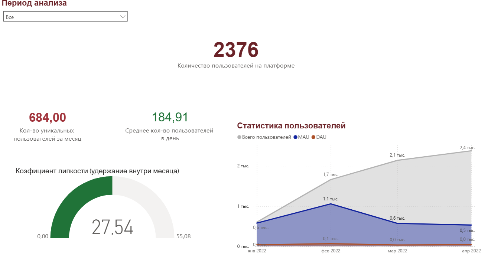

# Продуктовая аналитика: Анализ вовлеченности (Engagement & Growth)

## 📌 О проекте
Цель проекта — аудит «здоровья» образовательной платформы на базе 500к+ событий. Проведен комплексный расчет метрик роста аудитории и интенсивности использования сервиса.

## 🛠 Стек технологий
* **SQL (PostgreSQL/SQLite):** Оконные функции (`SUM OVER`), сложные агрегации (`AVG` от `COUNT DISTINCT`), обработка временных рядов.
* **Power BI:** Создание интерактивного дашборда, моделирование связей (Relationships), расчет продуктовых KPI.

## 📊 Ключевые показатели (Insights)
* **Анализ роста:** За 4 месяца база зарегистрированных пользователей выросла с 0.5k до **2.4k** человек.
* **Эффект «Ножниц»:** Выявлен разрыв между ростом общей базы и активностью (MAU). Несмотря на приток новых юзеров, ежемесячная активность снизилась в 2 раза после февраля, что указывает на низкое удержание (Retention) новых когорт.
* **Sticky Factor (Липкость):** Коэффициент удержания внутри месяца составляет **27.54%**. Это высокий показатель, подтверждающий наличие лояльного ядра аудитории, использующего сервис почти ежедневно.

## 🖼 Визуализация

## 🚀 Реализованный функционал:
1. **Data Cleaning:** Исключение тестовых аккаунтов (ID < 94) для чистоты метрик.
2. **DAU/MAU Analysis:** Расчет динамики уникальных пользователей в день и в месяц.
